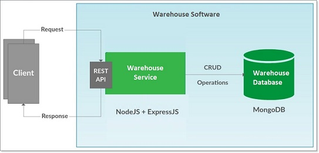

### Warehouse Software

### About Project

The project is to implement a warehouse software. This software should hold articles, and the articles should contain an identification number, name and a available stock. It should be possible to load articles into the software from a file, see the attached inventory.json.

The warehouse software should also have products, products are made of different articles. Products should have a name, price and a list of articles of which they are made from with a quantity. The products should also be loaded from a file, see the attached products.json.


The warehouse should have at least the following functionality;
* Get all products and quantity of each that is available with the current inventory
* Remove(Sell) a product and update the inventory accordingly

### Technologies
Warehouse Software built using Node.js with MongoDB as database.


### Solution Design and implementation
Warehouse Software consists of a RESTful service and a database. The RESTful Warehouse Service is developed using Node.js with Express.js.and MongoDB used as a database for the service to interact.



### Application Structure

- `index.js` - The entry point to the application. Loads coniguration file,all the collections and makes connection to the DB.
- `config.js` - This file contains configuration data.
- `route.js` - This file contains the route definitions for API.


## API Documentation

### POST Add/update articles.

```
/api/article
```
##### Single article
```
curl -X POST -H "content-type: application/json" -d '{"inventory": {"art_id": 1, "name": "leg", "stock": 12}}' http://127.0.0.1:3000/api/article
```

##### Multiple articles

```
curl -X POST -H "content-type: application/json" -d '{"inventory": [{"art_id": 1, "name": "leg", "stock": 12}, {"art_id": 2, "name": "screw", "stock": 17}, {"art_id": 3, "name": "seat", "stock": 2}, {"art_id": 4, "name": "table top", "stock": 1}]}' http://127.0.0.1:3000/api/article
```

### GET Articles

##### Single article
```
/api/article/:art_id
```

```
curl -X GET http://127.0.0.1:3000/api/article/1
```

##### GET all articles

```
/api/article
```

```
curl -X GET http://127.0.0.1:3000/api/article
```

### DELETE Articles

```
/api/article
```

##### Single article
```
curl -X DELETE -H "content-type: application/json" -d '{"inventory": {"art_id": 1}}' http://127.0.0.1:3000/api/article
```

##### Multiple articles

```
curl -X DELETE -H "content-type: application/json" -d '{"inventory": [{"art_id": 1}, {"art_id": 2}, {"art_id": 3}]}' http://127.0.0.1:3000/api/article
```

--------------------------------------

### POST Add/update products.

```
/api/product
```

##### Single product
```
curl -X POST -H "content-type: application/json" -d '{"products": {"product_id": 1, "name": "Dining Chair", "price": 2000.34, "contain_articles": [{"art_id": 1, "amount": 1}, {"art_id": 2, "amount": 2}]}}' http://127.0.0.1:3000/api/product
```

##### Multiple products

```
curl -X POST -H "content-type: application/json" -d '{"products": [{"product_id": 1, "name": "Dining Chair", "price": 2000.34, "contain_articles": [{"art_id": 1, "amount": 1}, {"art_id": 2, "amount": 2}]}, {"product_id": 2, "name": "Dining table", "price": 1500.99, "contain_articles": [{"art_id": 1, "amount": 4}, {"art_id": 2, "amount": 8}, {"art_id": 4, "amount": 1}]}]}' http://127.0.0.1:3000/api/product
```

### GET Products

##### Single product
```
/api/product/:product_id
```

```
curl -X GET http://127.0.0.1:3000/api/product/1
```

##### Multiple products

```
/api/product
```

```
curl -X GET http://127.0.0.1:3000/api/product
```

### DELETE Products

```
/api/product
```


##### Single product

```
curl -X DELETE -H "content-type: application/json" -d '{"products": {"product_id": 1}}' http://127.0.0.1:3000/api/product
```

##### Multiple products

```
curl -X DELETE -H "content-type: application/json" -d '{"products": [{"product_id": 1}, {"product_id": 2}]}' http://127.0.0.1:3000/api/product
```

### API to handle files

Use files in test folder.

POST request as:

```
curl -X POST -H "content-type: application/json" -d @inventory.json http://127.0.0.1:3000/api/article
```


### Data format

Requests should always be made in JSON format. Also, you will get data back in JSON format.

`content-type: application/json`

### GUI

GUI is only to view the inventory and products,no other functionalities are perfomed.
